# 木工 Woodworking
我是个生活在纽村（新西兰）的摸鱼码农，业余爱好木工，这里所指的木工是偏向于家具制作或者细木工（Furniture Making / Fine woodworking），开这个 Repo 把这几年入坑所积攒知识记录下来分享给大家，也希望能让大家从中获取有用的知识或者避开我踩过的坑，也欢迎指正我的错误。

在村里工作生活了很多年，一开始并没有玩木头，而是玩单反，但慢慢的觉得太过于花钱和麻烦（修图），也没人看我的照片就丢在一边吃灰，直到结婚成家买了自己的房子。

在拥有自己的房子后第一件事肯定是想如何装修和布置，在看家具的时候被村里的价格吓到，从而想到可以从国内买家具运过来，既然要运家具当然就不能随便买便宜货了，那时候脑子里第一个想到的就是实木家具，在研究了一番之后决定走定制家具的路线, 也就从这时候开始对木工产生了兴趣。

# 入坑前
## 1. 心理准备

当你准备入坑的时候第一件事是先想清楚你是不是真的想入坑，其次是想实现什么，想要达到什么样的结果，因为木工这项爱好可深可浅，可大可小，可便宜可昂贵。
根据我多年的观察，大部分人只是想有个木工技能，在闲暇时间做点小东西或者维护一下房子，并不想真正的花很多时间在木工这方面。其实木工真正玩下去之后你会发现这玩意花钱花时间，对场地也有一定的要求，还会有噪音粉尘（身体健康）问题，最重要的还有家人是否支持。
如果都想清楚决定入坑，那么欢迎入坑，让我们一起卷起来。

## 2. 安全，安全，安全

**!!! 注意安全!!!**
重要的事情要说三遍，在木工这项爱好里面安全尤为重要。
工作的时候请做好相关保护措施（护目镜，口罩，隔音耳罩等等）。工作的时候会使用各种各样的工具，其中很大一部分是锋利的刀类，如果不按照安全规范来使用，会很容易对自己或者别人甚至动物造成不可逆的伤害，所以开工之前，使用工具之前一定想好要做什么，这样做是否安全，是否有更好更安全的替代方案。
如果你觉得心里没底，那请不要继续下去，这种情况往往会出事情, 请一定要三思

一般木工的安全装备包括且不限于以下装备：
- 护目镜
- 隔音耳罩
- 防尘口罩（N95），防毒口罩
- 手套
- 安全鞋
- 尾裙

## 3. 金钱与时间

俗话说时间就是金钱，这个在木工的世界里也是成立的，这个可以分为两个部分：

资金的投入与工作效率：
一般来说，在工具方面投入的资金越多，效率越高（工具党，收集党除外）

时间的投入与产出：
一般来说，在一件作品上面花的时间越多，成品越精细，约等于价格越高

## 4. 场地

木工对场地是有一定要求的，取决于要做的物件大小，小到阳台，大到独立工作室。生活在海外，最常见的就是车库了，目前我占用着半个车库来作为我的木工工作室，里面包含了台锯，带锯，平刨，压刨，集尘器，木工桌等等

## 5. 学习资源

对我来说这种重实践的技能动手比看书看视频来的直接，失败几次之后基本上就懂得该怎么做才能做好。以下 YouTube 和书籍都是比不错的木工知识来源。

- YouTube 频道
	-  [RobCosman. Com](https://www.youtube.com/user/robc45)
	-  [Paul Sellers](https://www.youtube.com/c/PaulSellersWoodwork)
	-  [The Wood Whisperer](https://www.youtube.com/user/TheWoodWhisperer)
	- [Wood By Wright](https://www.youtube.com/channel/UCbMtJOly6TpO5MQQnNwkCHg)
	-  [Matt Estlea](https://www.youtube.com/channel/UCxWzA3ZlYEOLr1JkKH0ZMyg)
	-  [Free Online Woodworking School](https://www.youtube.com/channel/UCNGaGS5ve2fv936pSaedRng)
	-  [Jonathan Katz-Moses](https://www.youtube.com/channel/UCXBNF-A7QlYT3tT-B9N4ElA)
	-  [ISHITANI FURNITURE](https://www.youtube.com/channel/UC7FkqjV8SU5I8FCHXQSQe9Q)
	- [Stumpy Nubs](https://www.youtube.com/user/StumpyNubsWorkshop)
	-  [Hooked on Wood](https://www.youtube.com/channel/UCuvjeMfKGqSoYc32Xk5MLfQ)
	- [WOOD magazine](https://www.youtube.com/user/Wood)
	- [木作犟人](https://www.youtube.com/channel/UC9_pMtOqm7xL-SQSJ16J9zA)
	- [Yongchao Wang](https://www.youtube.com/channel/UCfowSd_l-rnpKonl4Wgifzw)
	- [망치소리 Hammer sound](https://www.youtube.com/c/%EB%A7%9D%EC%B9%98%EC%86%8C%EB%A6%ACHammersound)
	- [Dorian Bracht](https://www.youtube.com/c/DorianBracht)

- 书籍
	- Collins Complete Woodworkers Manual
	- Woodwork: A Step-by-Step Photographic Guide to Successful Woodworking
	- Workbenches: From Design and Theory to Construction and Use
	- Essential joinery : the fundamental techniques every woodworker should know
	- Woodworking : techniques & projects for the first-time woodworker
	- 木工職人基礎手工具+陳秉魁做一個漂亮的木榫

## 6. 软件
- [SketchUp/SkethUp Pro](https://www.sketchup.com/)
- SketchUp 插件: [OpenCutList](https://github.com/lairdubois/lairdubois-opencutlist-sketchup-extension)
- [Blender](https://www.blender.org/)
- [Mechanical Blender](http://mechanicalblender.org/)
- 各种 CAD 软件
- [Kumiko Designer 组子设计](https://www.kumikodesigner.com/)
- [Compound Angle Calculator 角度计算](https://jansson.us/jcompound.html)

# 入坑
## 1. 工作方式
木工工作方式有三个党派：纯手工党，混合党，电动工具与机械党。三种方式各有各的优缺点，也各有各的乐趣，我个人是混合党，下面就来分析各个党派的优缺点。
- 纯手工党
	- 优点: 能最大程度的享受手工工具和工作的过程 (Process), 使用起来很安静, 不影响家人和邻居, 同时也是三个党派里面最安全的
	- 缺点: 一般来说慢, 效率低, 花时间，需要耐心，费力
- 混合党
	- 优点: 效率相比纯手工党来说有大幅提升, 对于一般玩家来说是三个党派里最友好的, 能让玩家更容易得到成就感, 批量生产相对容易, 工件精度相对有保障. 混合党对与家庭作坊来说应该算是最优解, 有些东西适合用电动工具/机械, 有些东西反而用手工工具更合适
	- 缺点: 对场地有一定的要求, 电动工具/机械比较危险, 对集尘和隔音有更高的要求
- 电动工具/机械党
	- 优点: 更高的精度, 合适大批量重复性生产
	- 缺点: 场地要求更高, 资金投入更大, 不适合家庭工房

## 2. 中式，日式，欧式 (西式)
这世上手工工具主要有三个流派，流派的选择主要会影响你对工具的选择，间接影响在工具上的投入，我个人是欧式和日式结合。
* 中式
	第一印象就是中式刨子和框锯, 小时候印象最深的就是那个长者牛角的孢子, 还有木工师傅坐在板凳上刨木头
	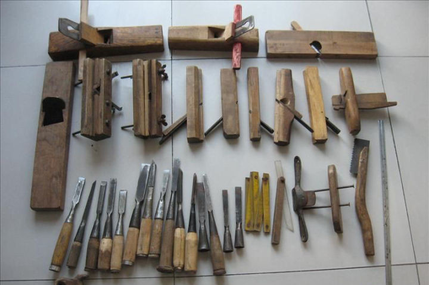
* 日式
	日式是由中式演化而来, 最主要的特点是"拉 (pull)", 例如拉刨, 拉锯. 还有可能是受到武士刀的影响, 一般会觉得他们的钢材性能比较好, 好友的就是用起来舒服
	
	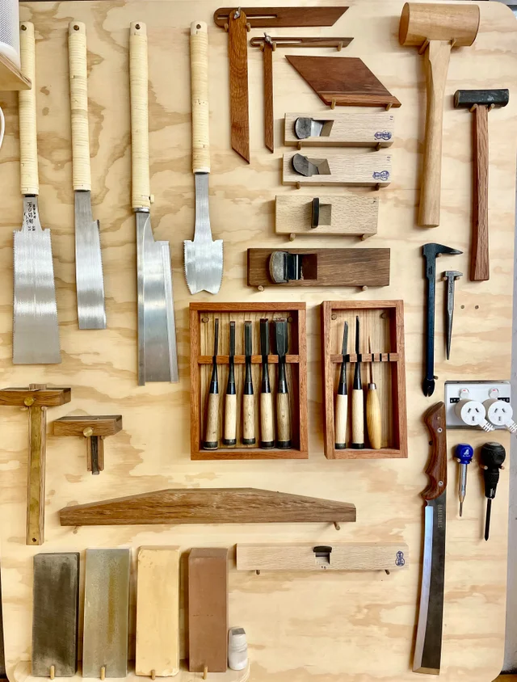
* 欧式 (西式)
	欧式工具第一印象就是金属, 各种各样的工具都是金属制的. 其实他们一开始也是从木制工具开始的, 后来走向金属化, 这个变化在刨子上面最为明显, 从一开始的简单木制刨子演化到带有复杂调整机构的金属刨, 虽然金属刨的结构复杂, 但是对于新手来说使用起来是最简单的. 欧式工具主要是以"推 (push)"为主
	
	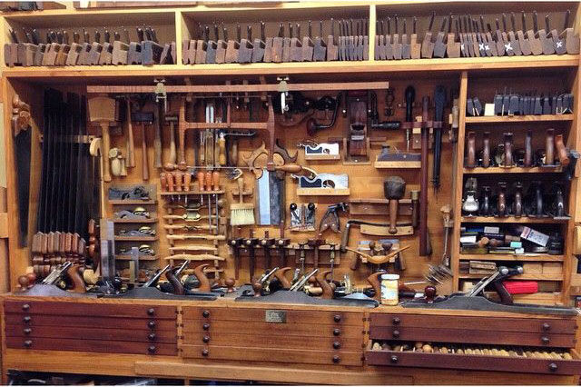

	

## 3. 主要入门工具的选择
这部分主要分为手工工具和电动 (机械) 工具的选择, 主要讲入门级别的选择, 更高级的选择会在详细的分类里面进行说明.
* 手工工具
	玩木工是脱离不了手工工具的，刨子，凿子，锤子，锯子这四样是最基本的. 刚开始玩的时候为了省钱买了很多乱七八糟的手工工具,  比如刨子就买过很多中式的,  都头来因为入门门槛高和刚入坑不懂,  现在几乎全部在吃灰. 
	为了避免刚入坑花冤枉钱，下面推荐一些是值得买的入门级别手工工具,  推荐的不一定便宜,  但性价比高,  好用
	* 刨刀
		在中式, 日式, 欧式里面数欧刨对新手最友好, 熟练使用难度系数为欧式 > 中式=日式, 别看它的结构复杂, 它的调整与精确度是三种里面最容易实现的, 能让使用者更容易得到成就感. 这里面主要的难点在于刀刃的调整与刨身的维护, 据我所知日式拉刨在刚买回来的时候是不能直接使用的, 需要对刨体, 压铁 (盖铁/cap iron/chip breaker) 进行一定的修整才能使用 ([日式刨的调整 Tuning and Using Japanese Hand Planes - WOOD magazine](https://www.youtube.com/watch?v=e07dTYfYaww)), 中式刨身调整我并没有深入了解, 这里就不讨论, 中式和日式的刨刃是通过锤子的敲击来调整, 这需要使用者有一定的经验才能比较好地调整, 同时在维护方面来说, 木制刨身是需要更细心的保养, 综合以上来说中式日式的刨子对于新手来说门槛太高. 
		
		反观欧刨, 得益于其复杂的机械调整结构, 不需要额外的工具 (锤子) 就能很容易地调整刨刃的进刀量和平行度, 金属刨身也仅仅需要做好防锈即可, 简直是业余爱好者的福音.
		价格上一般来说欧刨会比中式, 日式的木刨贵, 但由于使用和维护简单, 这笔投资是值得的.
		
	    当我们想少花钱, 第一件事想到的就是买二手, 如果买二手, 我只研究过两个牌子, 一个是 Stanley, 另一个是 Record. 作为入门刨子, 优先选择 No.4 和 No.5 1/2 (有时候 No.5 1/2 比较难找, 可以找 No.5, 这两个只有刀刃宽度的区别) 这两个型号, 理由是这两个的大小能满足至少 80% 的工作需求, 当熟悉之后在慢慢入手别的型号. 
	    - Stanley 是个历史悠久的牌子, 他们在以前是很出名的工具制造商, 但后来因为机械化的发展, 他们慢慢开始没落, 工具品质也走下坡路. 当我们买二手 Stanley 的时候主要看那些有几十年甚至上百年历史的金属刨子, 最直接了当的是看刨体是否有 Bailey 字样 (只针对 Bench Plane). Stanley 工具产品线非常复杂，更详细的请参考样 [[手工工具 (Hand Tools)/刨 (Plane)/古董欧刨 - Stanley 和 Record]]
	    - Record 据我所知一开始是 Stanley 的 copycat, 生产线和 Stanley 一模一样, 后期才有一些区分, 有些老木匠说 Record 的刨子有时候会比 Stanley 的质量更好，买 Stanley 还是 Record 就看个人喜好了
	    
	    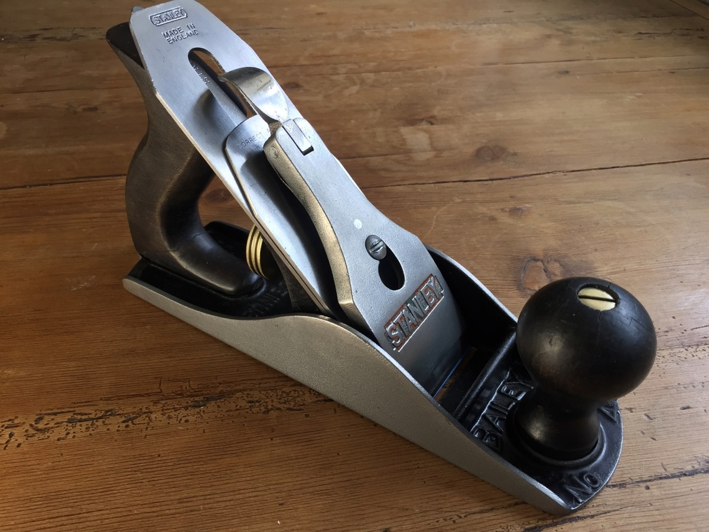
		
		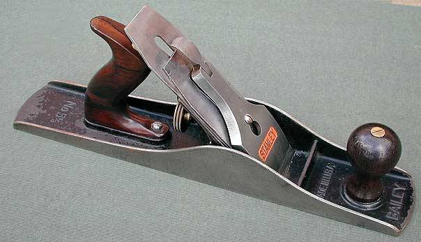
		
		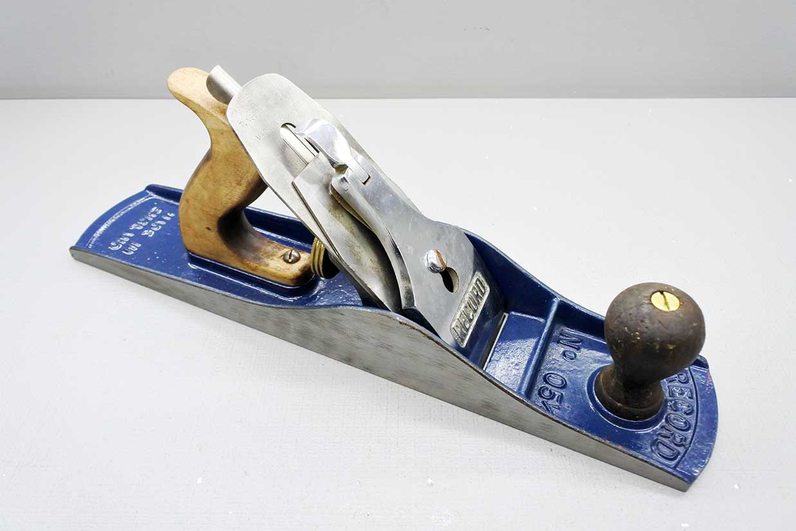
	    
		如果想买全新的话, 就不得不提到国产的牌子 - 鲁班, 这个牌子是浙江省慈溪市[强生工具](http://www.qstools.com/index.asp) (淘宝 [鲁班工坊](https://shop106100651.world.taobao.com/shop/view_shop.htm?spm=a1z09.2.0.0.2f832e8dQK7jqp&user_number_id=1799062986)) 生产的, 这个厂商同时给海外的很多品牌代工, 例如北美的 [WoodRiver](https://www.woodcraft.com/categories/planes), 欧洲的 [JUUMA](https://www.fine-tools.com/juuma-planes.html). 他们主要是根据 Stanley 样式来生产铁刨, 结构和质量上是值得信赖的. 这几个牌子几乎占领了欧刨的中端市场, 推荐入门型号也同样是 No. 4 和 No. 5 1/2 这两个型号。
		由于村里没有这些牌子的代理商, 所以对于纽村的朋友来说, 就比较麻烦了, 优先建议是从淘宝  (甚至是闲鱼买二手) 购买然后海运过来, 这样的花费是最少的, 如果没有淘宝也可以通过澳洲木工店购买: https://www.timbecon.com.au/brands/luban, 这家店提供直邮村里
	* 凿子
		凿子的样式也是多种多样, 一般只需要买这四个宽度 (24mm, 18mm, 13mm, 6mm) 的斜凿 (Bevel Edge Chisel) 这是最常用也是最万能的凿子
		
		先说二手, 在村里我只知道 Marples 这个牌子, 我有幸在二手市场用便宜的价格买过一套, 那个刀刃持久度非常好也很耐用, 后来就没买过二手的凿子了, 如果有不错的也欢迎补充
		
		
		
		全新的话优先推荐 Narex (捷克) 然后是 Two Cherries (德国) 和鲁班 (中国), Narex 是出了名的高性价比, 性能优秀, 价格合适, Two Cherries 也差不多, 但推荐的人不如 Narex 多. 鲁班的凿子没用过, 但鉴于他们的刨刀都不错, 凿子应该也差不到哪去
		Narex: https://www.timbecon.com.au/brands/narex
		
		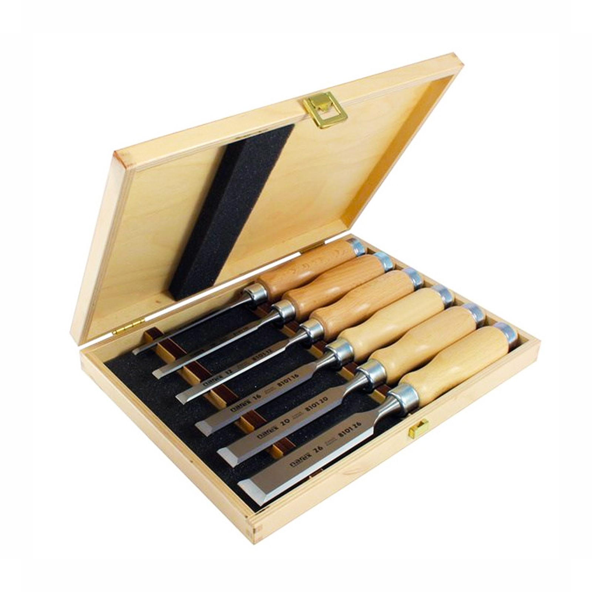
		Two Cherries: https://piranhatools.co.nz/collections/brand-two-cherries-germany
		
		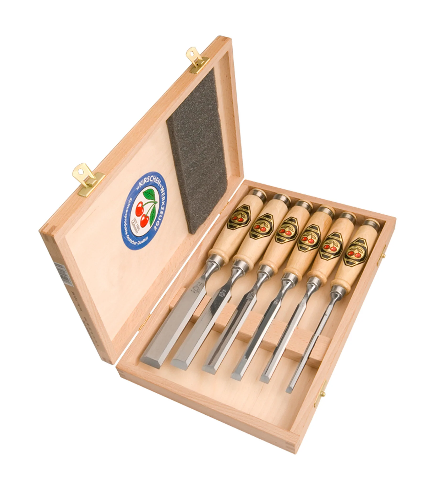
		鲁班: https://www.timbecon.com.au/brands/luban
		
		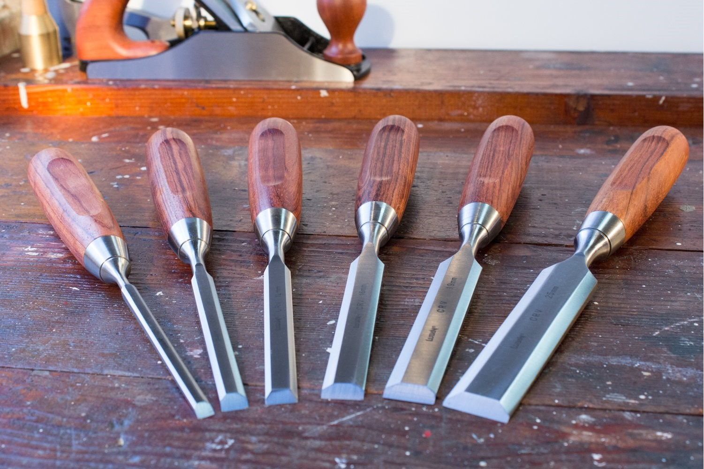
	* 锤子
		小知识: 锤子在英文里面会看到 Hammer 和 Mallet, 一般 Hammer 指金属锤子, Mallet 指非金属锤子, 例如木头。
		锤子有各种各样的样式, 一般都挺便宜, 可以直接看本地有没有新的买, 或者可以自己找块木头做一个用来练手, 作为自己的第一个木工作品
		* 方形木槌, 这种是最常用的锤子, 木制锤身在敲击的时候可以降低对被敲击物的伤害, 特别是凿子, 有些凿子的手柄顶端没有金属卡箍, 使用金属锤子敲击的话很容易把手柄给敲坏 (英文: Mushrooming)
		* 雕刻锤, 这种一般是雕刻用的锤子, 一般为木制或者铜制, 圆筒形, 除非你要玩雕刻, 否则几乎不会用到
		
		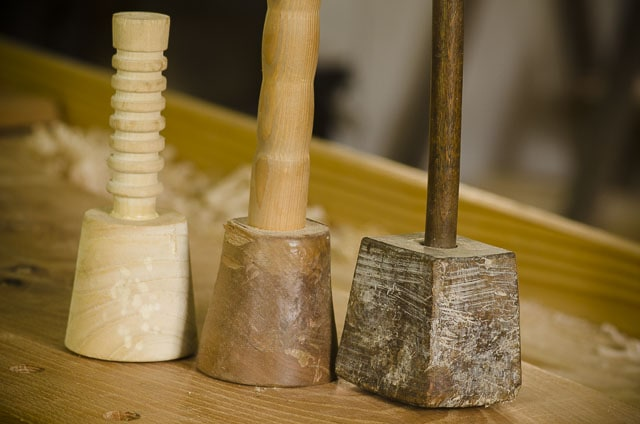
		* 铁锤, 羊角锤, 这就是一般家用的锤子, 基本上是用来锤钉子或者防身, 谁家里没一个锤子呢
		
		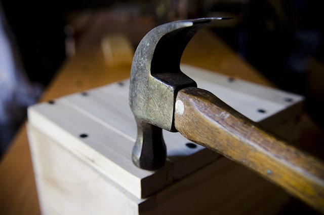
		
		* 橡胶锤, 这种锤子在组装工件的时候特别有用, 敲击木材的时候不会对木头造成损伤
		
		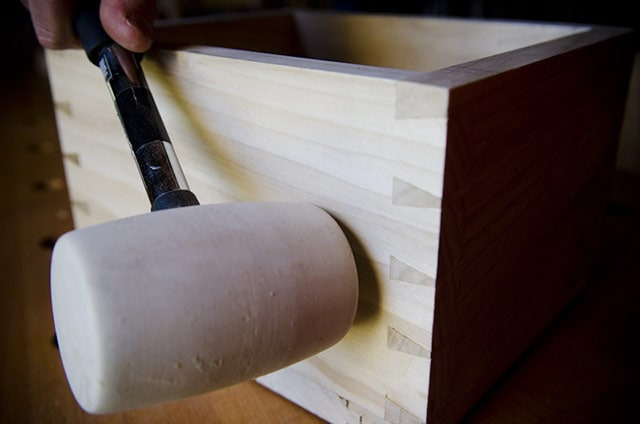
		
		* 日本锤, 又称玄能锤, 一般是用来敲击凿子, 调整刨刀用, 由于锤头是金属头, 就看个人喜好和配套工具是什么了
		
		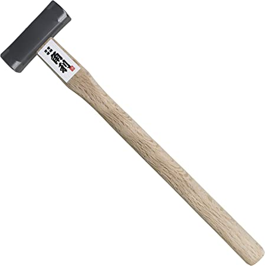
		
		* 小 (铜) 锤, 这种小锤子一般是用来调整刨刀刀片的, 一般材质是脚软的金属 (铜) 或者木头, 这样在敲击刀片的时候不会对刀片造成伤害, 如果玩的是欧刨的话几乎不会用到这样的锤子, 因为绝大部分台刨 (Bench plane) 都带有平行调节机构 (当然也有例外), 如果是玩日本刨或者中式刨, 甚至是有调整需求的可以考虑买一个
		
		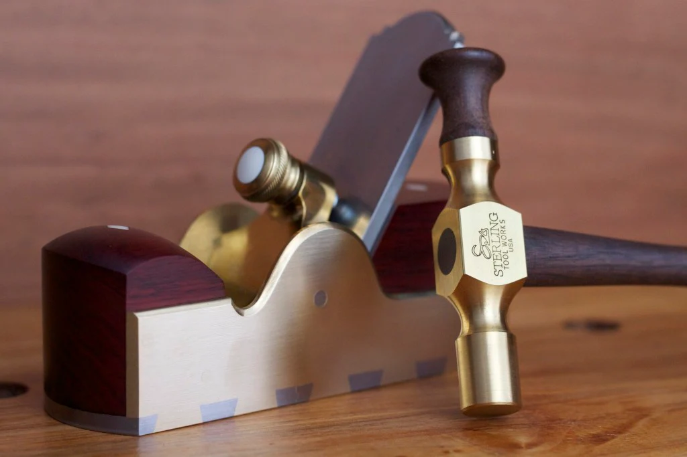
		
		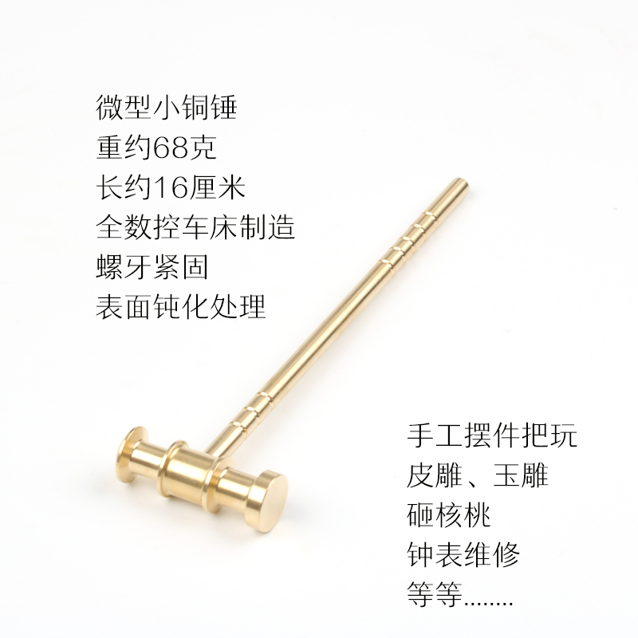
	* 锯子

## 4. 木材连接方式/榫卯
木材的连接方式有传统的榫卯 (例如燕尾榫, 粽角榫), 现代机械榫 (例如 Festool Domino, biscuit Joint 饼干榫, dowel 圆木榫), 五金连接。
- 传统榫卯
	- 优点: 好看, 秀技, 传家宝
	- 缺点: 需要练习, 花时间, 需要耐心
- 现代榫
	- 优点: 可以使用电动工具快速制作, 上手简单, 相对美观 (看不到连接件)
	- 缺点: 电动工具相对危险, 对工件有一定局限性 (厚度, 宽度), 工具可能较贵, 耗材需要花钱 (当然也能自己制作)
- 五金连接
	- 优点: 快速, 灵活
	- 缺点: 五金件相对昂贵, 耐久度有待商量
